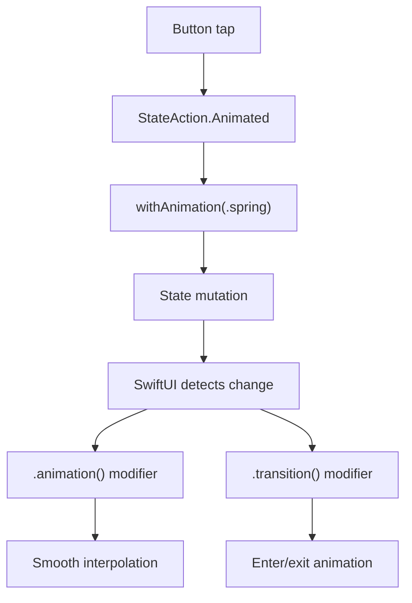

# Animations

sui provides three animation primitives that map to SwiftUI's animation system.

## Animated State Mutations

Wrap any `StateAction` in `StateAction.Animated` to animate the change:

```haxe
// Instant (no animation)
new Button("Toggle", null, StateAction.Toggle("expanded"))

// Animated with spring curve
new Button("Toggle", null,
    StateAction.Animated(StateAction.Toggle("expanded"), "spring"))
```

This generates:
```swift
// Instant
Button("Toggle") { expanded.toggle() }

// Animated
Button("Toggle") { withAnimation(.spring) { expanded.toggle() } }
```

Any `StateAction` can be wrapped:

```haxe
// Scale with bounce
StateAction.Animated(StateAction.SetValue("scale", 1.5), "bouncy")

// Increment with ease
StateAction.Animated(StateAction.Increment("count", 1), "easeInOut")

// Multiple mutations
StateAction.Animated(StateAction.CustomSwift("scale = 1; rotation = 0"), "spring")
```

### Animation Curves

| Curve | Description |
|-------|-------------|
| `"default"` | System default |
| `"easeIn"` | Starts slow, speeds up |
| `"easeOut"` | Starts fast, slows down |
| `"easeInOut"` | Slow at both ends |
| `"spring"` | Spring physics with overshoot |
| `"linear"` | Constant speed |
| `"bouncy"` | Playful bounce |

## Animation Modifier

The `.animation()` modifier tells SwiftUI to animate a view when a state variable changes:

```haxe
@:state var scale:Float = 1.0;

new Text("Hello")
    .scaleEffect(scale)
    .animation("spring", "scale")
```

When `scale` changes, the scale effect animates with a spring curve. Without the second parameter, all state changes trigger animation:

```haxe
new Text("Hello")
    .opacity(alpha)
    .animation("easeInOut")
```

### Combining with State-Bound Modifiers

Visual effect modifiers accept `State<Float>` references for dynamic values. These are type-checked at compile time. Pair them with `.animation()` for smooth transitions:

```haxe
@:state var cardScale:Float = 1.0;
@:state var cardRotation:Float = 0.0;
@:state var cardBlur:Float = 0.0;

new GroupBox("Card", [
    new Text("Animated!")
        .font(FontStyle.Title)
])
.scaleEffect(cardScale)
.rotationEffect(cardRotation)
.blur(cardBlur)
.animation("spring", "cardScale")
.animation("easeInOut", "cardRotation")
.animation("easeOut", "cardBlur")
```

Then mutate the state with `Animated` to trigger:

```haxe
new Button("Bounce", null,
    StateAction.Animated(
        StateAction.CustomSwift("cardScale = cardScale == 1.0 ? 1.3 : 1.0"),
        "spring"
    ))
```

## Transitions

The `.transition()` modifier defines how a view enters and exits when used inside a `ConditionalView`:

```haxe
new Button("Show Detail", null,
    StateAction.Animated(StateAction.Toggle("showDetail"), "spring"))

new ConditionalView("showDetail",
    // Slides in from the edge
    new Text("Detail content")
        .padding()
        .background(ColorValue.Blue)
        .cornerRadius(12)
        .transition("slide"),

    // Fades out
    new Text("Tap to show detail")
        .transition("opacity")
)
```

### Transition Styles

| Style | Description |
|-------|-------------|
| `"opacity"` | Fade in/out |
| `"slide"` | Slide from leading edge |
| `"scale"` | Scale from small to full size |
| `"move"` | Move from an edge |
| `"push"` | Push old view out, new view in |

### How Animations Flow



### Important

Transitions only animate when the state change is itself animated. Use `StateAction.Animated` on the toggle:

```haxe
// This animates the transition:
StateAction.Animated(StateAction.Toggle("visible"), "spring")

// This does NOT — the view appears/disappears instantly:
StateAction.Toggle("visible")
```

## Full Example

```haxe
class AnimApp extends App {
    static function main() {}

    @:state var showDetail:Bool = false;
    @:state var scale:Float = 1.0;
    @:state var rotation:Float = 0.0;

    public function new() {
        super();
        appName = "Animations";
        bundleIdentifier = "com.sui.animations";
    }

    override function body():View {
        return new VStack(null, 30, [
            // Card with animated transforms
            new Text("Hello!")
                .font(FontStyle.Title)
                .scaleEffect(scale)
                .rotationEffect(rotation)
                .animation("spring", "scale")
                .animation("spring", "rotation"),

            // Animated buttons
            new HStack(null, 15, [
                new Button("Bounce", null,
                    StateAction.Animated(
                        StateAction.CustomSwift("scale = scale == 1.0 ? 1.3 : 1.0"),
                        "spring")),
                new Button("Spin", null,
                    StateAction.Animated(
                        StateAction.Increment("rotation", 90),
                        "easeInOut"))
            ]),

            // Toggle with animated transition
            new Button("Toggle Detail", null,
                StateAction.Animated(StateAction.Toggle("showDetail"), "spring")),

            new ConditionalView("showDetail",
                new Text("Detail!")
                    .padding()
                    .background(ColorValue.Blue)
                    .foregroundColor(ColorValue.White)
                    .cornerRadius(12)
                    .transition("slide")
            )
        ]).padding();
    }
}
```

## Run It

```bash
cd examples/animations
haxelib run sui run macos
```
