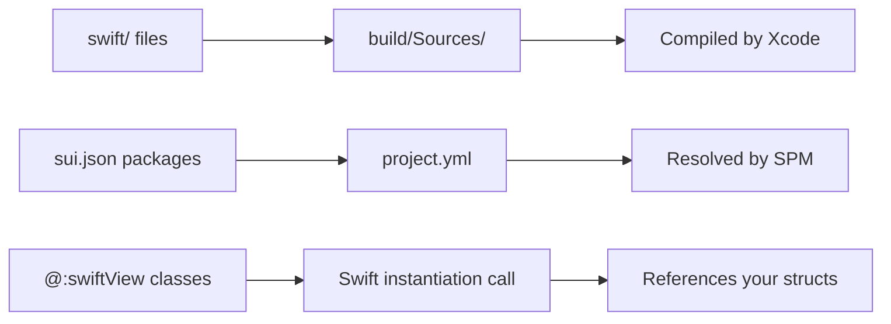

# Native Extensions

sui supports custom Swift code and Swift Package Manager dependencies alongside your Haxe app.

## Custom Swift Files

Drop `.swift` files into the `swift/` directory in your project root. They're automatically compiled into your app.

```
MyApp/
  src/
    MyApp.hx
  swift/
    MyNativeChart.swift
  build.hxml
  sui.json
```

### Example: Custom SwiftUI View

**swift/GradientCard.swift:**
```swift
import SwiftUI

struct GradientCard: View {
    let title: String

    var body: some View {
        Text(title)
            .padding()
            .frame(maxWidth: .infinity)
            .background(
                LinearGradient(
                    colors: [.blue, .purple],
                    startPoint: .leading,
                    endPoint: .trailing
                )
            )
            .foregroundColor(.white)
            .cornerRadius(12)
    }
}
```

### Referencing from Haxe

Use `@:swiftView` to create a Haxe wrapper, then use it in `body()` like any built-in view:

```haxe
@:swiftView("GradientCard")
class GradientCard extends View {
    public var title:String;
    public function new(@:swiftLabel("title") title:String) {
        super();
        this.title = title;
    }
}

class MyApp extends App {
    // ...
    override function body():View {
        return new VStack([
            new GradientCard("Welcome"),
            new GradientCard("Dashboard")
        ]);
    }
}
```

**Generated Swift:** `GradientCard(title: "Welcome")`

The `@:swiftView` class doesn't generate a Swift struct &mdash; it references the one in your `swift/` directory.

## SPM Dependencies

Declare Swift packages in `sui.json`:

```json
{
    "appName": "MyApp",
    "bundleIdentifier": "com.example.myapp",
    "bundleIdPrefix": "com.example",
    "swiftPackages": [
        {
            "url": "https://github.com/airbnb/lottie-ios",
            "from": "4.4.1",
            "product": "Lottie"
        }
    ]
}
```

Each entry needs:

| Field | Description |
|-------|-------------|
| `url` | Git URL of the Swift package |
| `from` | Minimum version (semver) |
| `product` | Product name to link |

### Using SPM Types in Custom Views

Your `swift/` files can import and use any declared package:

```swift
import SwiftUI
import Lottie

struct AnimatedLogo: View {
    var body: some View {
        LottieView(animation: .named("logo"))
            .looping()
            .frame(width: 200, height: 200)
    }
}
```

Then reference it from Haxe with `@:swiftView("AnimatedLogo")`.

## How It Works



- Swift files in `swift/` are copied verbatim &mdash; no code generation
- `@:swiftView` classes don't generate Swift structs &mdash; they reference yours
- SPM packages are resolved at build time by Xcode
- Custom Swift code has full access to SwiftUI, SPM packages, and generated app code
